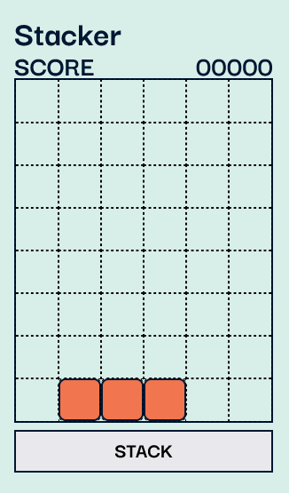
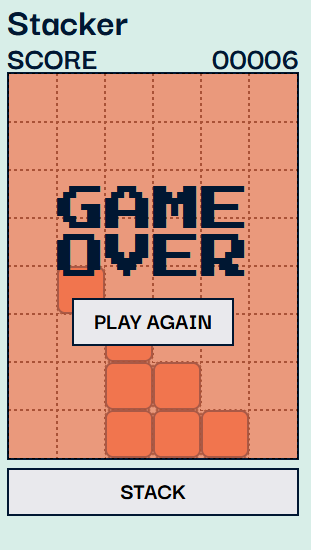

# Game of Sticker-stacker

## Table of contents

- [Overview](#overview)
  - [Screenshot](#screenshot)
  - [Links](#links)
- [My process](#my-process)
  - [Built with](#built-with)
  - [What I learned](#what-i-learned)
- [Author](#author)

## Overview

### Screenshot

, , 

### Links

- Live Site URL: [A game of Sticker Stacker](https://irinakrdmva.github.io/Sticker-stacker/)

## My process

### Built with

- Semantic HTML5 markup
- CSS custom properties
- Flexbox
- CSS Grid
- JavaScript

### What I learned

This was a very fun project, and I have Boolean Uk to thank for this. I have learned to manipulate JS and the logic behind what makes the basics of old school games.

## Author

- Website - [Irina K](https://www.irinakrdmva.pt)
